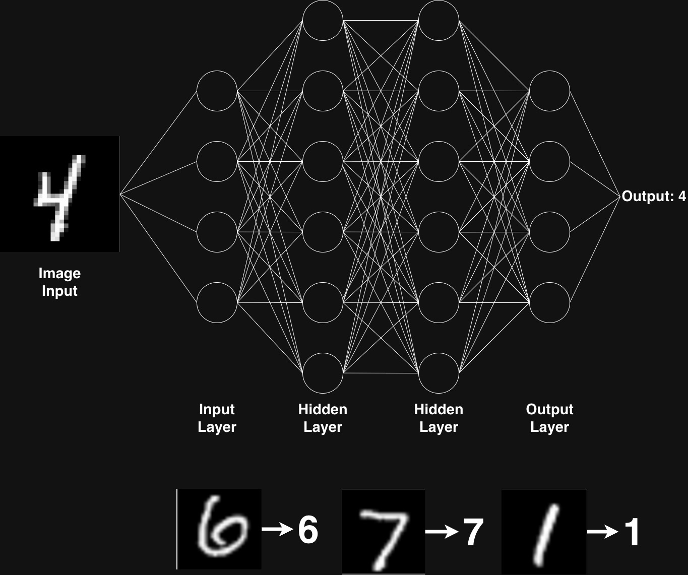

# 🧠 Neural Network from Scratch (C++)

Inspired by the [3Blue1Brown Video Series](https://www.youtube.com/playlist?list=PLZHQObOWTQDNU6R1_67000Dx_ZCJB-3pi), this project is a low-latency implementation of a Multi-Layer Perception (MLP) Neural Network in C++ from scratch. The model is designed to classify images of hand-drawn digits by mapping raw pixel data to one of ten possible output classes (0-9).



### 👾 Model Features and Motivation
---
- Has feed forward and backpropagation functionality
- Uses the ReLU activation function, coupled with a softmax function for transforming output layer into a probability distribution function
- Adjustable and flexible network size and shapes
- Trains on the MNIST dataset

I built this project in an effort to learn more about high-performance C++, C++ industry practices and deep learning. Absolute no generative A.I. was used to implement the model, and I attribute my learning to the following textbooks:

- **Introduction to Statistical Learning** by James, Witten, Hastie and Tibshirani
- **C++ High Performance** by Andrist and Sehr
- **Beautiful C++** by Davidson and Gregory
- **C++ Software Design** by Iglberger

### 🔨 Setup
---
```shell
# Clone the repository and change into it
git clone https://github.com/johnpioc/neural-network-cpp.git 
cd neural-network-cpp

# Allow yourself to execute the build script then run it
chmod +x build.sh
./build.sh

# Run the executable
./neural_network_cpp
```

Which should result in the following (training time will depend on your system):

```
Neural Network Arguments: 

Number of Layers: 4
Hidden Layer 1 size: 16
Hidden Layer 2 size: 16

Training Observations: 60000
Test Observations: 10000
Training completed in 20.02 seconds.
Model Test Set Accuracy: 7.88%
```

<u>**Program Parameters:**</u>
- `-l layer_size_1,layer_size_2,...`: Hidden layer sizes. For e.g. `-l 16,16`

### 📊 Historical Stats
---
| **Date** | **Number of Hidden Layers** | **Hidden Layer Sizes** | **Training Time** | **Test Set Model Accuracy** |
|----------| ---------------------| ----------------| ------------------|----------------|
|02/12/2025| 2 | 16, 16 | 20.02s | 7.88% |
|02/12/2025| 2 | 256, 128 | 292.04s | 23.78% |